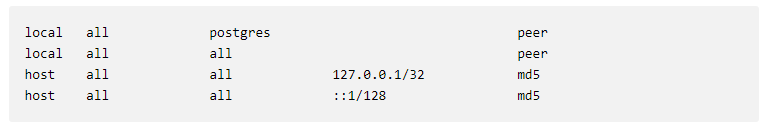

# Linux Server Configuration for Web App
_Configure Amazon Lightsail Linux Server To host Web App_

## SERVER INFORMATIONS

**PUBLIC IP :**  `13.232.118.216`

**INITIAL LOGIN URL FOR SHELL :** `ssh ubuntu@13.232.118.216 -i ~/.ssh/LightsailDefaultPrivateKey.pem`

**SSH PORT AFTER STEP 4 :** `2200`

**UPDATED LOGIN URL FOR SHELL AFTER STEP 4 :** `ssh ubuntu@13.232.118.216 -i ~/.ssh/LightsailDefaultPrivateKey.pem -p 2200`

**USERNAME :**  `grader`

**PASSWORD :**  `grader`

**Login command for Grader :**  `ssh grader@13.232.118.216 -i ~/.ssh/graderKeyPair -p 2200`

**PASSPHRASE :**  `grader`


## PROCEDURE

### _Getting Your Server________________________

#### STEP 1 : Start a new Ubuntu Linux server instance on Amazon Lightsail
* Log in to Lightsail
* Create an instance
* First, choose "OS Only" (rather than "Apps + OS"). Second, choose Ubuntu as the operating system.
* Choose your instance plan
* Give your instance a hostname
* Wait for it to start up
* Once your instance has started up, you can log into it with `Connect using SSh`
* `public IP` address of the instance is displayed along with its `User name`
* Download `private key` of SSH KEY PAIR.
* save this .pem file to `~/.ssh` directory

#### STEP 2 : SSH into your server
* Use these commands to SSH into your server from your console
    ```commandline
    ssh ubuntu@13.232.118.216 -i ~/.ssh/LightsailDefaultPrivateKey.pem
    ```

### _Securing Your Server________________________

#### STEP 3 : Update all currently installed packages
* Use these commands to update installed packages
    ```commandline
    sudo apt-get update
    sudo apt-get upgrade
    ```
* If *** System restart required *** is displayed at login, run:
    ```commandline
    sudo reboot
    ```

#### STEP 4 : Change the SSH port from 22 to 2200
* Firstly, Open port 2200 in `Lightsail > Networkind > Firewall` to avoid locking yourself out by adding:
    ```textmate
    Application   Protocol    Port range
    Custom        TCP	  2200
    ```
* Open `/etc/ssh/sshd_config` file using :

    ```commandline
    sudo nano /etc/ssh/sshd_config
    ```
* Change the line `Port 22` to `Port 2200`
* Then restart the SSH service:
    ```commandline
    sudo service ssh restart
    ```
* New command to login to the server:

    ```commandline
    ssh ubuntu@13.232.118.216 -i ~/.ssh/LightsailDefaultPrivateKey.pem -p 2200
    ```
    
#### STEP 5 : Configure the Uncomplicated Firewall (UFW) 
Allow incoming connections for SSH (port 2200), HTTP (port 80), and NTP (port 123)
* Check UFW status
    ```commandline
    sudo ufw status
    ```
* Block all incoming connections on all ports
    ```commandline
    sudo ufw default deny incoming
    ```
* Allow outgoing connection on all ports
    ```commandline
    sudo ufw default allow outgoing
    ```
* Allow incoming connection for SSH on port 2200
    ```commandline
    sudo ufw allow 2200/tcp
    ```
* Allow incoming connections for HTTP on port 80
    ```commandline
    sudo ufw allow www
    ```
* Allow incoming connection for NTP on port 123
    ```commandline
    sudo ufw allow ntp
    ```
* check the rules that have been added before enabling the firewall
    ```commandline
    sudo ufw show added
    ```
* enable the firewall
    ```commandline
    sudo ufw enable
    ```
* Check UFW status again
    ```commandline
    sudo ufw status
    ```
    
### _GIVING GRADER SERVER ACCESS________________________
Giving `grader` access to log in to my server for reviewing my project.
#### STEP 6 : Create a new user account named `grader`
* Create user `grader`
    ```commandline
    sudo adduser grader
    ```
#### STEP 7 : Give `grader` the permission to `sudo`
* If you are signed in using a non-root user with sudo privileges, type
    ```commandline
    sudo visudo
    ```
* Search for the line that looks like this:
    ```commandline
    root    ALL=(ALL:ALL) ALL
    ```
* Below this line, copy the format you see here, changing only the word 
"root" to reference the new user that you would like to give sudo privileges to:
    ```commandline
    root    ALL=(ALL:ALL) ALL
    newuser ALL=(ALL:ALL) ALL
    ```
* Sign In to user `grader`
    ```commandline
    sudo su - grader
    ```
* Sign Out of user `grader`
    ```commandline
    exit
    ```

#### STEP 8 : Create an SSH key pair for `grader` using the `ssh-keygen` tool
Enable Key Based Authentication
* Generate SSH Key Pairs locally on your system using application `ssh-keygen`, type:
    ```commandline
    ssh-keygen
    ```
* Enter file in which to save the key (/home/user/
.ssh/id_rsa):
    ```commandline
    /home/user/.ssh/graderKeyPair
    ```
* Two Files will be created inside `~/.ssh/` i.e `graderKeyPair` `graderKeyPair.pub`

* Place the Public Key on our remote server so that SSH can use it to log in
    1. make .ssh dir inside `/home/grader/`
        ```commandline
        sudo mkdir /home/grader/.ssh
        ```
    2. create `authorized_keys` file inside `/home/grader/.ssh`
        ```commandline
        sudo touch /home/grader/.ssh/authorized_keys
        ```
        this is a special file will store all the public keys this account 
        is allowed to use for authentication.
    3. Copy the contents of `/home/user/.ssh/graderKeyPair.pub` from the local machine 
    
    4. open `authorized_keys` file inside `/home/grader/.ssh`
        ```commandline
        sudo nano /home/grader/.ssh/authorized_keys
        ```
    
    5. paste Copied Content into `/home/grader/.ssh/authorized_keys` file
        

* Set permission of `.ssh` & `authorized_keys` so that other user can not gain access to your account
    ```commmandline
    sudo chmod 700 /home/grader/.ssh
    sudo chmod 644 /home/grader/.ssh/authorized_keys
    ```
* Changer ownership of `.ssh` & `authorized_keys` grader so that grader can gain access to these file
    ```commmandline
    sudo chmod 700 /home/grader/.ssh
    sudo chmod 644 /home/grader/.ssh/authorized_keys
    ```

### _PREPARE TO DEPLOY YOUR PROJECT________________________
#### STEP 9 : Configure the local timezone to UTC
* Check the timezone
    ```commandline
    date
    ```
* If it's not UTC change it to UTC using: 
    ```commandline
    sudo timedatectl set-timezone UTC
    ```

#### STEP 10 : Install and configure Apache to serve a Python mod_wsgi application
* Install Apache:
    ```commandline
    sudo apt-get install apache2
    ```
    * Confirm Apache is working by replacing `public_ip` with your public IP and visiting : 
        ```commandline
        http://public_ip:80
        ```
    * You should see the following page: 
        
        Apache, by default, serves its files from the `/var/www/html`. Apache just returns a file requested or the `index.html` file if no file is defined

* Install the `libapache2-mod-wsgi` package:
    ```commandline
    sudo apt-get install libapache2-mod-wsgi
    ```
    It configure Apache to hand-off certain requests to an application handler - mod_wsgi
    * If project is built using `Python 3` use this instead:
        ```commandline
        sudo apt-get install libapache2-mod-wsgi-py3
        ```
* configure Apache to handle requests using the WSGI module by editing `/etc/apache2/sites-enabled/000-default.conf` file.
    1. open `/etc/apache2/sites-enabled/000-default.conf` file
        ```commandline
        sudo nano /etc/apache2/sites-enabled/000-default.conf
        ```
    1. add the following line at the end of the `<VirtualHost *:80>` block, right before the closing `</VirtualHost>` line: 
        ```commandline
        WSGIScriptAlias / /var/www/html/myapp.py
        ```
    1. Finally, restart Apache 
        ```commandline
        sudo apache2ctl restart
        ```
    * To test if you have your Apache configuration correct you can write a very basic WSGI application :
        
        _WSGI is a specification that describes how a web server communicates with web applications. Most Python web frameworks are WSGI compliant including Flask and Django. Despite having the extension .wsgi, these are just Python applications_
        
        1. defined the name of the file you need to write within your Apache configuration by using the `WSGIScriptAlias` directive
            ```commandline
            WSGIScriptAlias /test_wsgi /var/www/html/test_wsgi.py
            ```
            which is already done in above step
        1. Create the /var/www/html/myapp.wsgi file using the command : 
            ```commandline
            sudo nano /var/www/html/test_wsgi.py
            ```
        1. Within this file, write the following application: 
            ```python
               def application(environ, start_response):
                   status = '200 OK'
                   output = 'Hello World From WSGI!'
    
                   response_headers = [('Content-type', 'text/plain'), ('Content-Length', str(len(output)))]
                   start_response(status, response_headers)
    
                   return [output]
            ```
        1. Finally, restart Apache 
            ```commandline
            sudo apache2ctl restart
            ```
        1. If everything goes as expected, open your favorite web browser and type the URL `http://your-server-ip/test_wsgi` and hit `Enter`, You will get the newly created application:
            


#### STEP 11 : Install and configure PostgreSQL
* Install PostgreSQL with:
    ```commandline
    sudo apt-get install postgresql postgresql-contrib
    ```
    * Do not allow remote connections
        
        _A simple way to remove a potential attack vector is to not allow remote connections to the database. This is the current default when installing PostgreSQL from the Ubuntu repositories._ 
        
        1. Open the postgres config file
            ```commandline
            sudo nano /etc/postgresql/9.5/main/pg_hba.conf
            ```
        1. double check that no remote connections are allowed by looking in the host based authentication file:
            
        
        1. As you can see, the first two security lines specify "local" as the scope that they apply to. This means they are using Unix/Linux domain sockets.
        
        1. The second two declarations are remote, but if we look at the hosts that they apply to (127.0.0.1/32 and ::1/128), we see that these are interfaces that specify the local machine.
                
    * Create a new database user named `catalog` that has limited permissions to your catalog application database.
        1. Create a linux user named `catalog`
            ```commandline
            sudo adduser catalog
            ```
        
        1. Create a PostgreSQL user(role) called `catalog` with:
            ```commandline
            sudo -u postgres createuser -P catalog
            ```
            you are `Prompted` for a password(-P). This creates a normal user that can't create databases, roles (users).
        1. create the database `catalog` with `catalog` as owner.
            ```commandline
            sudo -u postgres createdb -O catalog catalog
            ```
    * To Check If Databse and User Created Successfully:
        
        * Log into PostgreSQL using:
            ```
            sudo su - postgres
            psql
            ```
        * List all the current **Owners**(Role) and their attributes by typing:
            ```
            \du
            ```
        * Login to **Owner**(Role) `catalog` by typing UNIX command:
            ```
            psql -h localhost -U user_name -p <port>
            ```
        * If you don't know the port, you can always get it by running the following, as the postgres user,
            ```
            SHOW port;
            ```
        * Show all **databases** having `catalog` as owner:
            ```
            \l
            ```
        * Select **Database** `catalog`:
            ```
            \c catalog
            ```
        * Show all **tables** within `catalog` database:
            ```
            \c dt
            ```
        * Log out PostgreSQL to follow along with this section:
            ```
            sudo su - postgres
            psql
            ```

#### STEP 12 : Install git
* Install git using command:
    ```commandline
    sudo apt-get install git
    ```